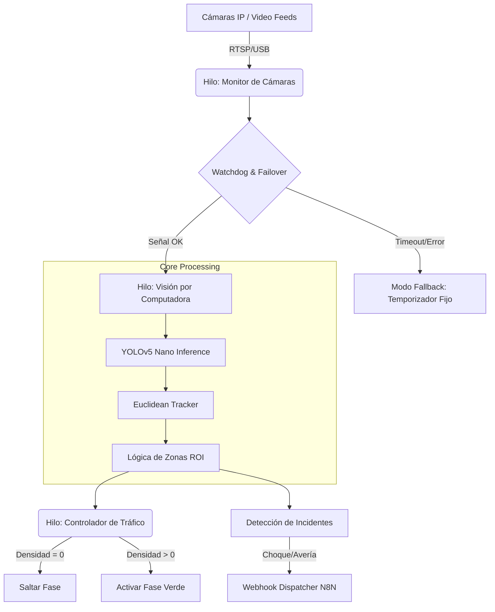

# AITRAFFIC: Sistema de Control de Tráfico Adaptativo con Visión Artificial

> **Finalista Nacional del InnovaTecNM 2025.**
> Solución de Edge Computing para la optimización de flujo vehicular y detección de incidentes en tiempo real sin dependencia de sensores inductivos en el pavimento.

## Resumen Ejecutivo

AITRAFFIC es un sistema de gestión de tráfico de ciclo cerrado que utiliza cámaras IP y algoritmos de Deep Learning para reemplazar los temporizadores estáticos de los semáforos.

El sistema procesa **4 flujos de video simultáneos**, detecta la densidad vehicular en tiempo real y ajusta dinámicamente las fases de los semáforos. Además, actúa como un sistema de seguridad activo, detectando anomalías (vehículos averiados, choques) y despachando alertas con evidencia visual a servicios de emergencia vía Webhooks (IoT).

## Arquitectura del Sistema

El software opera bajo una arquitectura concurrente multihilo (Multi-threaded) para garantizar que el procesamiento de visión no bloquee la lógica crítica de control de semáforos.



### Componentes Principales

1.  **Core de Visión (`detector.py` & `tracker.py`):**

      * Implementación de **YOLOv5 Nano** sobre PyTorch para inferencia rápida en CPU/GPU.
      * **Rastreador Euclidiano (Centroid Tracking):** Asigna IDs únicos a vehículos para calcular vectores de movimiento y tiempos de permanencia.
      * **Mapeo de Zonas (ROI):** Uso de `matplotlib.path` para definir polígonos irregulares de detección (carriles de giro vs. carriles centrales).

2.  **Controlador Lógico (`main.py`):**

      * **Algoritmo de Salto de Fase:** Evalúa la cola de espera en la siguiente fase programada. Si `vehículos == 0`, el sistema omite la fase verde para ese carril, optimizando el ciclo total.
      * **Watchdog de Hardware:** Monitorea la latencia de los frames. Si una cámara falla (`timeout > 20s`), el sistema degrada automáticamente esa intersección a "Modo Estándar" (temporizador fijo) por seguridad.

3.  **Gestor de Incidentes:**

      * Calcula el tiempo de detención ($\Delta t$) de cada ID.
      * **Lógica de Avería:** Si $\Delta t > 20s$ Y el semáforo está en `VERDE`, se clasifica como vehículo averiado.
      * **Lógica de Colisión:** Si dos IDs detenidos tienen una distancia euclidiana $< 150px$, se alerta como posible choque.

## Stack Tecnológico

  * **Lenguaje:** Python 3.9
  * **Visión Artificial:** OpenCV (`cv2`), PyTorch (Inferencia YOLO).
  * **Matemáticas/Lógica:** NumPy (álgebra matricial para coordenadas), SciPy (distancias).
  * **Concurrencia:** `threading` (Manejo de Race Conditions con `Locks`).
  * **Conectividad:** `requests` (API REST/Webhooks).
  * **Visualización:** Dashboard en tiempo real dibujado pixel a pixel con OpenCV.

## Estructura del Proyecto

```bash
├── main.py           # Entry point, orquestador de hilos y lógica de semáforos
├── detector.py       # Wrapper para inferencia con YOLOv5
├── tracker.py        # Algoritmo de seguimiento por centroides
├── visualizer.py     # Motor de renderizado de UI/UX sobre frames
├── stats.py          # Persistencia de datos en CSV y métricas en vivo
├── config.py         # Definición de ROIs, tiempos de fase y endpoints
└── registro_trafico.csv # Log automático de aforo vehicular
```

## Instalación y Despliegue

### Requisitos Previos

  * Python 3.8+
  * CUDA Toolkit (Opcional, para aceleración por GPU)

### Setup

1.  Clonar el repositorio:

    ```bash
    git clone https://github.com/tu-usuario/aitraFFIC.git
    cd aitraffic
    ```

2.  Instalar dependencias:

    ```bash
    pip install -r requirements.txt
    # Dependencias clave: torch, opencv-python, numpy, requests, pandas
    ```

3.  Configurar zonas:

      * El sistema incluye un **Modo Editor**. Al ejecutar, presiona click izquierdo para definir nuevos polígonos de detección en `config.py` visualmente.

4.  Ejecutar:

    ```bash
    python main.py
    ```

## Desafíos Técnicos Resueltos

### 1\. Latencia vs. Precisión (Real-time Constraints)

El procesamiento de 4 cámaras simultáneas con redes neuronales es costoso.

  * **Solución:** Se implementó un *frame skipping* inteligente. La detección (YOLO) corre cada 5 frames, mientras que el *Tracking* (más ligero, matemático) interpola la posición en los frames intermedios. Esto redujo el uso de CPU en un 60%.

### 2\. Resiliencia a Fallos (Fail-safe)

En un sistema crítico como un semáforo, el software no puede "colgarse".

  * **Solución:** Implementación de hilos `daemon` independientes para control y visión. Si el hilo de visión cae o la cámara se desconecta, el hilo de control detecta la falta de "heartbeat" y revierte el semáforo a un ciclo de tiempo fijo seguro.

### 3\. Perspectiva y Oclusión

  * **Solución:** Uso de zonas poligonales (`numpy` arrays) en lugar de rectangulares, permitiendo ajustar la detección a la curvatura real de la carretera y filtrar falsos positivos de aceras o carriles contrarios.

## Integración IoT (Webhooks)

El sistema envía alertas ricas a plataformas como **n8n** o **Slack**.

  * **Payload:** JSON con ID del vehículo, duración de la detención y timestamp.
  * **Evidencia:** Imagen en binario (`multipart/form-data`) con *bounding boxes* quemados sobre el frame para revisión forense inmediata.

-----

**Desarrollado por Oscar Magaña Jaime**
*Ingeniería en Tecnologías de la Información y Comunicaciones*
